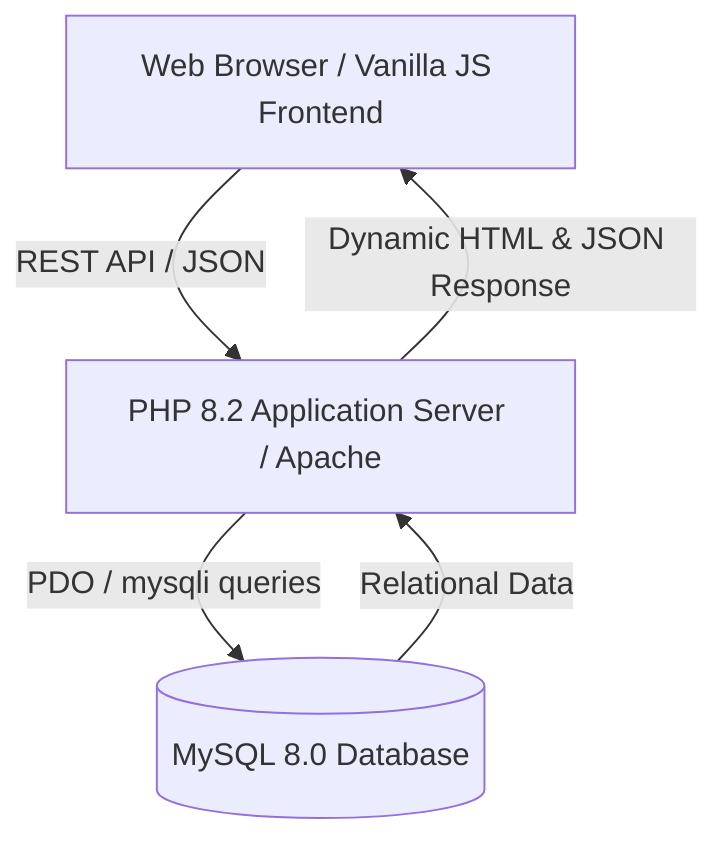

# 🍳 Smart Recipe Platform

[](https://your-live-demo-url.render.com)
[](https://www.php.net/)
[](https://www.mysql.com/)
[](https://www.docker.com/)
[](LICENSE)

> A modern, intelligent food & recipe web application featuring an **Ingredient-Based Smart Search Engine** that matches available household ingredients to optimal recipes using a multi-factor relevance scoring algorithm.

---

## 🌟 Key Features

### 🔍 1. Ingredient-Based Smart Search (Core Engine)
- **Tokenized Matching**: Input ingredients like `egg, noodle, tomato` to receive relevant recipe recommendations.
- **Relevance Scoring Algorithm**: Computes weighted scores across recipe titles, ingredients, categories, and tags.
- **Dynamic Sorting**: Filter results by relevance match score, rating, prep time, or novelty.

### 👤 2. User & Recipe Management
- **Interactive Browsing**: Discover recipes, collections, and trending dishes.
- **Recipe Creation**: User-submitted recipes with rich media, ingredient lists, and step-by-step instructions.
- **Personal Bookmarks**: Save and manage favorite recipes.

### 🛡️ 3. Administrative Control Dashboard
- **Analytics Dashboard**: Real-time overview of users, active recipes, and community metrics.
- **Content Moderation**: Manage recipes, user permissions, comments, and reports.
- **System Settings**: Category and tagging configuration.

---

## ⚡ Live Demo Credentials (for Recruiters & Reviewers)

| Role | Email | Password | Access Level |
| :--- | :--- | :--- | :--- |
| **User Demo** | `user@food.com` | `123456` | Standard recipe discovery, bookmarking, profile creation |
| **Admin Demo** | `admin@food.com` | `123456` | Full administrative dashboard, user & content moderation |

---

## 🏗️ System Architecture



---

## 📁 Folder Structure

```bash
smart-recipes/
├── backend/
│   ├── api/             # RESTful API Endpoints (Auth, Recipes, Admin)
│   └── config/          # Environment & Database Configuration (12-Factor App)
├── database/            # SQL Schema & Seed Data Scripts
├── frontend/
│   ├── assets/          # CSS Modules, JS Libraries, Images
│   ├── includes/        # PHP Layout Components (Navbar, Footer, Bootstrap)
│   └── pages/           # Application Views (Home, Search, Admin, Auth)
├── Dockerfile           # Production Container Configuration
├── docker-compose.yml   # Multi-container Orchestration (App + MySQL)
└── README.md
```

---

## 🚀 Quick Start (Local Setup)

### Option A: Using Docker (Recommended - 1 Click)

```bash
# 1. Clone the repository
git clone https://github.com/your-username/smart-recipes.git
cd smart-recipes

# 2. Spin up containers using Docker Compose
docker-compose up -d

# 3. Access application
# Open http://localhost:8080 in your browser
```

### Option B: Using XAMPP / Native PHP & MySQL

1. **Clone project** to your web root (`htdocs` or `www`).
2. **Import Database**:
   - Create database `food_recipe_db` in phpMyAdmin.
   - Import `database/food_recipe_db (1).sql`.
3. **Configure Environment**:
   - Copy `.env.example` to `.env` and fill in DB credentials if needed.
4. **Run Application**:
   - Access `http://localhost/smart-recipes` in your browser.

---

## 🛡️ Production & Deployment Readiness

- **12-Factor App Compliance**: DB configurations use `getenv()` environment variables for zero-downtime Cloud deployment.
- **Containerized Deployment**: Ready for Render, Railway, Fly.io, or AWS EC2 with Docker integration.
- **Security Best Practices**: Parameterized SQL queries, password hashing (`password_hash`), XSS sanitization.

---

## 📝 License

Distributed under the **MIT License**. See `LICENSE` for more information.
